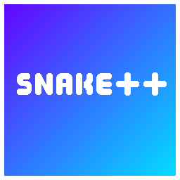

<!-- Shield Placements -->
[![Issues][issues-shield]][issues-url]
[![License][license-shield]][license-url]

<!-- Project Logo -->

    <a href="https://github.com/Khossy/SnakePlusPlus">
        </img>
    </a>
    <h3 align=center>Snake++</h3>
    

        A terminal Snake game made in Visual C++, have fun!  
        <a href="https://github.com/Khossy/SnakePlusPlus/pulls"><strong>« Pull Requests »</strong></a>
          
        <a href="https://github.com/Khossy/SnakePlusPlus/releases">All Releases</a> •
        <a href="https://github.com/Khossy/SnakePlusPlus/issues">Report Issue</a> •
        <a href="https://github.com/Khossy/SnakePlusPlus/issues">Request Feature</a>
    

## About: Snake++
**Snake++** is a terminal Snake game made in Visual C++, the project was compiled and made with [Visual Studio 2019.](https://visualstudio.microsoft.com/) The following program is **Windows-only**, Linux/UNIX/MacOS users can not play **Snake++** because of the code.
## Getting Started
### Prerequisites
• [**Visual Studio 2019**](https://visualstudio.microsoft.com/) - An **IDE** (Integrated Development Environment) application used to create Snake++, **recommended**.  
• **A Good Understanding of [C++](https://www.cplusplus.com/)** - You must have a good understanding of **C++** in order to make good changes to the project, if you want to contribute to the project but not have a good understanding of C++, please visit https://cplusplus.com to learn C++ for free.
### Installation
• Clone the repository in your Visual Studio `repos` folder, the location of that folder is `C:/YOUR_NAME/source/repos`, and for cloning the repository, here's the command: `git clone https://github.com/Khossy/SnakePlusPlus.git`
<h6>Note: You must have Visual Studio installed in order to have the "source/repos" folder.</h6>

## Contributing
If you want to contribute to **Snake++**, please note that you must...  

• Add features that either make the game easier or more fun to play.  
• Fix bugs or errors  

...and you must **not**...  

• Incidentally create bugs and/or errors  
• Add useless features  
• Add viruses/trojans into the software  

### Instructions
• Fork this repository.  
• Create a new branch for your changes.  
• Commit your changes/features.  
• Push them to your branch.  
• Create a new Pull Request on this repository.

<h6>So if you want to contribute to Snake++, please follow all of the above, and have fun programming your changes!</h6>

## Contact
• Discord: **🌺Khossy#0533**  
• Twitter: [@KhossyTheCoder](https://twitter.com/KhossyTheCoder)

<h6>Snake++ was made by Khossy, have fun!</h6>

<!-- Variables -->
[issues-shield]: https://img.shields.io/github/issues/Khossy/SnakePlusPlus?label=Issues&style=flat-square
[issues-url]: https://github.com/Khossy/SnakePlusPlus/issues
[license-shield]: https://img.shields.io/github/license/Khossy/SnakePlusPlus?color=lightgrey&label=License&style=flat-square
[license-url]: https://github.com/Khossy/SnakePlusPlus/blob/main/LICENSE